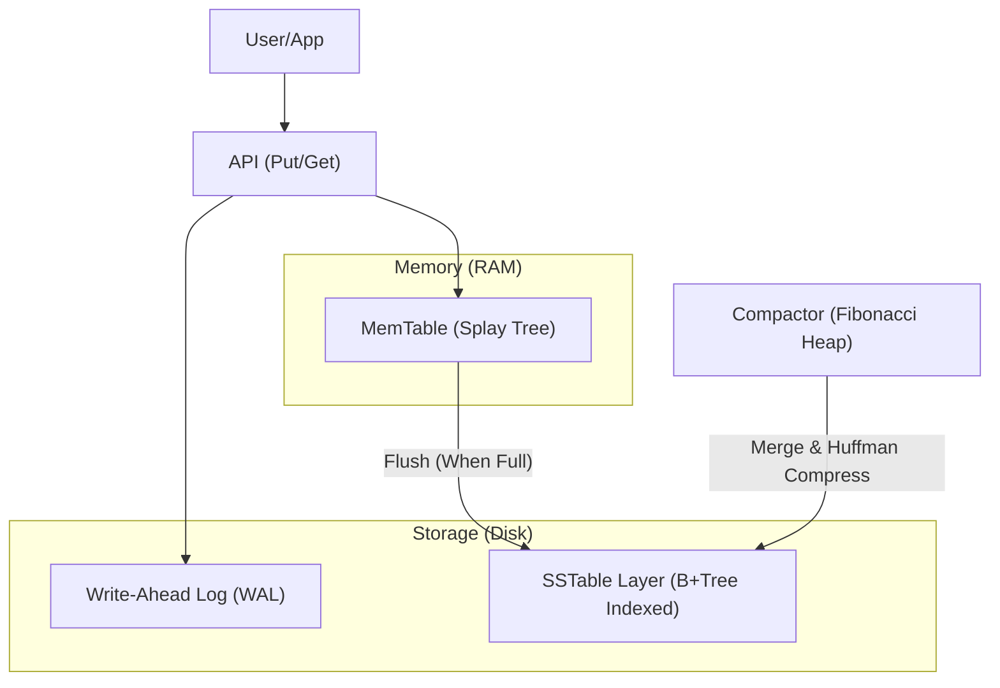

# EchoDB Architecture & Workflow

EchoDB follows a **Log-Structured Merge-Tree (LSM)** architecture, optimized for high-write-throughput with adaptive indexing.

---

## 🏗️ System Components

---

## 🔄 1. The Write Workflow (Write Path)
This is where the "High Speed" comes from. We never update data in place; we only append.

1.  **Log First**: Data is written to the **Write-Ahead Log (WAL)** on disk. This ensures that if the computer crashes, no data is lost.
2.  **Update MemTable**: The data is inserted into the **Splay Tree (MemTable)**.
    *   *Special Logic*: If the key already exists, the Splay Tree moves it to the root (Unit 1), making future updates to that same "hot" key faster.
3.  **Flush**: Once the MemTable reaches a size limit (e.g., 64MB), it is converted into an immutable **SSTable** (Sorted String Table) and written to disk.

---

## 🔍 2. The Read Workflow (Read Path)
EchoDB searches from the newest data to the oldest data.

1.  **Check MemTable**: Search the **Splay Tree**. If found, return instantly.
2.  **Check SSTables**: If not in RAM, search the on-disk files from most recent to oldest.
    *   *Internal Speed*: Each SSTable has a **B+Tree index** (Unit 1) at the footer. We jump directly to the correct data block rather than reading the whole file.
3.  **Return**: If not found in any layer, the key does not exist.

---

## 🛠️ 3. The Compaction Workflow (The "Garbage Collection")
Over time, multiple versions of the same key exist on disk. Compaction cleans this up.

1.  **Priority Selection**: The **Compactor** uses a **Fibonacci Heap** (Unit 1) to track all files on disk. The files with the most "overlapping" keys or oldest data are given the highest priority.
2.  **Merge-Sort**: Two or more SSTables are merged using a **Parallel Merge-Sort** algorithm (Unit 2/5).
3.  **Compression & Deduplication**:
    *   **LCS Algorithm**: During merging, we find duplicate patterns (Unit 3) to reduce redundancy.
    *   **Huffman Coding**: The final merged file is compressed (Unit 3) before being saved.
4.  **Cleanup**: The old, uncompressed files are deleted.

---

## 📊 Summary of Syllabus Integration
- **Unit 1**: **Splay Trees** (MemTable), **B+Trees** (SSTable Index), **Fibonacci Heaps** (Compaction Priority).
- **Unit 2**: **Merge-Sort** (Divide & Conquer for Compaction).
- **Unit 3**: **Huffman Coding** (Greedy Compression), **LCS** (DP for Deduplication).
- **Unit 5**: **Parallel Merge** (Handling disk I/O efficiently).
